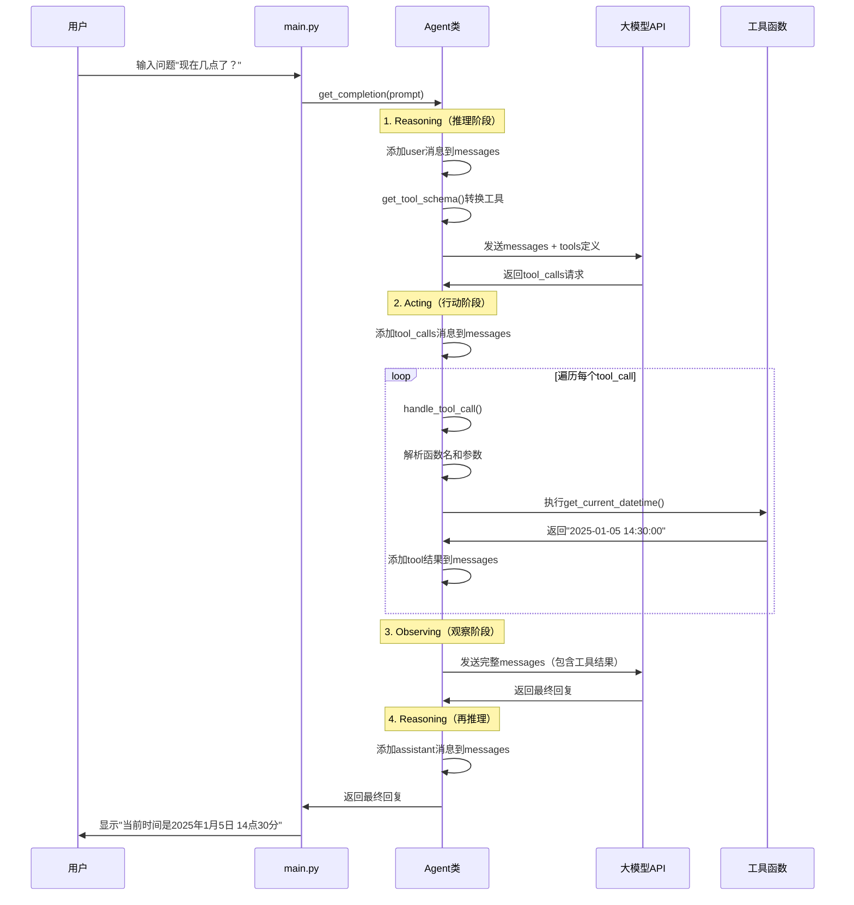

# Agent 调用原理流程图

## 📊 完整流程图（Mermaid）

```mermaid
graph TD
    Start([程序启动]) --> Init[初始化阶段]

    Init --> LoadEnv[加载环境变量<br/>.env文件]
    LoadEnv --> CreateClient[创建OpenAI客户端<br/>连接阿里云百炼]
    CreateClient --> ImportTools[导入工具函数<br/>get_current_datetime, add等]
    ImportTools --> CreateAgent[创建Agent实例]

    CreateAgent --> InitAgent[Agent.__init__]
    InitAgent --> StoreClient[存储client和model]
    StoreClient --> InitMessages[初始化messages列表<br/>添加system提示词]
    InitMessages --> CreateToolMap[创建tool_map映射<br/>函数名→函数对象]
    CreateToolMap --> Ready([Agent就绪])

    Ready --> UserInput[用户输入问题<br/>input函数]
    UserInput --> CheckExit{检查退出指令?}
    CheckExit -->|是| Exit([程序退出])
    CheckExit -->|否| CheckEmpty{输入为空?}
    CheckEmpty -->|是| UserInput
    CheckEmpty -->|否| CallGetCompletion[调用agent.get_completion]

    CallGetCompletion --> AddUserMsg[添加用户消息到messages<br/>role: user]
    AddUserMsg --> GetToolSchema[调用get_tool_schema<br/>转换工具为JSON Schema]
    GetToolSchema --> FirstAPI[第一次API调用<br/>发送messages和tools]

    FirstAPI --> LLM1[LLM推理<br/>判断是否需要工具]
    LLM1 --> CheckToolCalls{有tool_calls?}

    CheckToolCalls -->|否| DirectReply[直接回复用户]
    DirectReply --> AddAssistantMsg[添加assistant消息到messages]
    AddAssistantMsg --> ReturnResponse[返回最终回复]
    ReturnResponse --> Display[显示AI回答]
    Display --> UserInput

    CheckToolCalls -->|是| ReActLoop[进入ReAct循环]

    ReActLoop --> AddToolCallMsg[添加tool_calls消息到messages<br/>role: assistant]
    AddToolCallMsg --> ForEachTool[遍历每个tool_call]

    ForEachTool --> HandleToolCall[handle_tool_call处理]
    HandleToolCall --> ParseArgs[解析函数名和参数<br/>JSON字符串→字典]
    ParseArgs --> FindFunc[在tool_map中查找函数]
    FindFunc --> ExecuteFunc[执行Python函数<br/>func**args]
    ExecuteFunc --> GetResult[获取函数执行结果]
    GetResult --> CreateToolMsg[创建tool消息<br/>role: tool]
    CreateToolMsg --> AddToolMsg[添加tool结果到messages]

    AddToolMsg --> MoreTools{还有更多工具?}
    MoreTools -->|是| ForEachTool
    MoreTools -->|否| SecondAPI[第二次API调用<br/>发送完整messages和tools]

    SecondAPI --> LLM2[LLM再次推理<br/>基于工具结果]
    LLM2 --> CheckToolCalls2{还有tool_calls?}

    CheckToolCalls2 -->|是| ReActLoop
    CheckToolCalls2 -->|否| FinalReply[生成最终回复]
    FinalReply --> AddAssistantMsg

    style Start fill:#e1f5ff
    style Ready fill:#c8e6c9
    style Exit fill:#ffcdd2
    style LLM1 fill:#fff9c4
    style LLM2 fill:#fff9c4
    style ExecuteFunc fill:#f3e5f5
    style ReActLoop fill:#e3f2fd
```



## 🔄 ReAct 循环详细流程



## 📝 详细步骤说明

### 阶段一：初始化（Agent 创建）

```
1. 加载环境变量
   └─> 从 .env 文件读取 DASHSCOPE_API_KEY

2. 创建 OpenAI 客户端
   └─> base_url: "https://dashscope.aliyuncs.com/compatible-mode/v1"

3. 导入工具函数
   └─> get_current_datetime, add 等

4. 创建 Agent 实例
   ├─> 存储 client 和 model
   ├─> 初始化 messages = [{"role": "system", "content": SYSTEM_PROMPT}]
   └─> 创建 tool_map = {"函数名": 函数对象}
```

### 阶段二：用户交互循环

```
1. 获取用户输入
   └─> input("User: ")

2. 检查退出指令
   └─> if prompt.lower() in ["exit", "quit", "退出"]

3. 检查空输入
   └─> if not prompt.strip(): continue

4. 调用 Agent 处理
   └─> agent.get_completion(prompt)
```

### 阶段三：Agent 处理流程（ReAct 循环）

#### 步骤 1：添加用户消息

```python
self.messages.append({"role": "user", "content": prompt})
```

#### 步骤 2：第一次 API 调用（Reasoning）

```python
response = self.client.chat.completions.create(
    model=self.model,
    messages=self.messages,  # 包含系统提示词和用户问题
    tools=self.get_tool_schema(),  # 工具定义列表
)
```

**模型返回两种情况：**

- **情况 A**：直接回复（不需要工具）

  ```
  message = {
      "role": "assistant",
      "content": "你好！有什么可以帮助你的？"
  }
  ```

- **情况 B**：请求调用工具
  ```
  message = {
      "role": "assistant",
      "content": null,
      "tool_calls": [
          {
              "id": "call_123",
              "function": {
                  "name": "get_current_datetime",
                  "arguments": "{}"
              }
          }
      ]
  }
  ```

#### 步骤 3：工具调用循环（Acting）

如果 `message.tool_calls` 存在：

```python
# 3.1 添加 tool_calls 消息到历史
self.messages.append(message)

# 3.2 遍历并执行每个工具
for tool_call in message.tool_calls:
    # 3.2.1 解析工具调用信息
    function_name = tool_call.function.name  # "get_current_datetime"
    function_args = json.loads(tool_call.function.arguments)  # {}

    # 3.2.2 查找并执行函数
    func = self.tool_map[function_name]  # 从映射表查找
    result = func(**function_args)  # 执行函数

    # 3.2.3 添加工具结果到历史
    tool_result_message = {
        "role": "tool",
        "content": str(result),  # "2025-01-05 14:30:00"
        "tool_call_id": tool_call.id
    }
    self.messages.append(tool_result_message)
```

#### 步骤 4：第二次 API 调用（Observing + Reasoning）

```python
response = self.client.chat.completions.create(
    model=self.model,
    messages=self.messages,  # 现在包含：system + user + tool_calls + tool_result
    tools=self.get_tool_schema(),
)
```

**模型再次判断：**

- 如果还有 `tool_calls`：回到步骤 3（继续调用工具）
- 如果没有 `tool_calls`：生成最终回复

#### 步骤 5：返回最终回复

```python
self.messages.append({
    "role": "assistant",
    "content": message.content  # "当前时间是2025年1月5日 14点30分"
})
return message.content
```

## 🔑 关键数据结构

### messages 列表的演变过程

```python
# 初始状态
messages = [
    {"role": "system", "content": "你是一个叫JUN人工智能助手..."}
]

# 添加用户问题后
messages = [
    {"role": "system", "content": "..."},
    {"role": "user", "content": "现在几点了？"}
]

# 模型请求工具后
messages = [
    {"role": "system", "content": "..."},
    {"role": "user", "content": "现在几点了？"},
    {
        "role": "assistant",
        "tool_calls": [{"function": {"name": "get_current_datetime"}}]
    }
]

# 工具执行后
messages = [
    {"role": "system", "content": "..."},
    {"role": "user", "content": "现在几点了？"},
    {"role": "assistant", "tool_calls": [...]},
    {"role": "tool", "content": "2025-01-05 14:30:00"}
]

# 最终回复
messages = [
    {"role": "system", "content": "..."},
    {"role": "user", "content": "现在几点了？"},
    {"role": "assistant", "tool_calls": [...]},
    {"role": "tool", "content": "2025-01-05 14:30:00"},
    {"role": "assistant", "content": "当前时间是2025年1月5日 14点30分"}
]
```

## 🎯 核心组件说明

### 1. tool_map（工具映射表）

```python
# 作用：快速通过函数名查找函数对象
tool_map = {
    "get_current_datetime": <function get_current_datetime>,
    "add": <function add>
}
```

### 2. get_tool_schema()（工具转换器）

```python
# 作用：将 Python 函数转换为 JSON Schema
# 输入：Python 函数对象
# 输出：符合 API 规范的字典列表
```

### 3. handle_tool_call()（工具执行器）

```python
# 作用：执行模型请求的工具函数
# 流程：解析参数 → 查找函数 → 执行函数 → 返回结果
```

## 📊 性能优化点

1. **tool_map 映射表**：O(1) 查找，避免遍历列表
2. **工具 Schema 缓存**：可以缓存转换结果（当前实现每次重新转换）
3. **消息历史管理**：可以限制历史长度，避免上下文过长

## 🔍 调试技巧

1. **verbose 模式**：设置 `verbose=True` 可以看到工具调用过程
2. **打印 messages**：在关键位置打印 `self.messages` 查看状态
3. **检查 tool_calls**：确认模型是否正确识别工具

---

**流程图版本**：v1.0  
**最后更新**：2025-01-05
